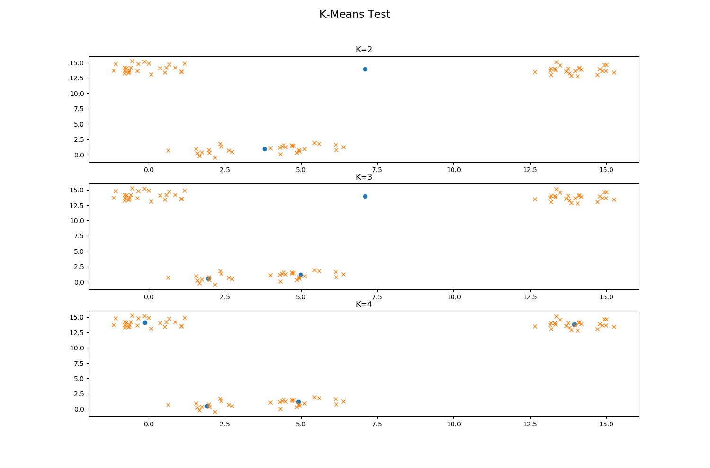
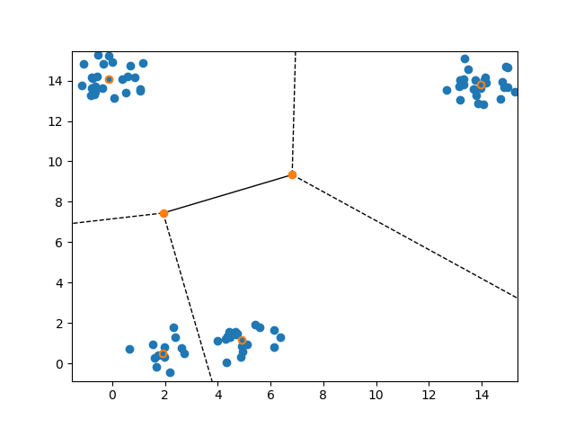

# K-Means Clustering Algorithm

The code demonstrates the usage of the K-Means clustering algorithm. We tried to replicate how the algorithm is used in industry by testing data classification with a variety of K clusters and then visually inspecting. In the image below, we test K values of 2-4.

Here we can see that K=4 fits the data the best.

To visualize the boundaries between clusters, we can use a Voronoi diagram:

### Input Location: 
input/points.txt (space delimited x & y float values)
### Output Location: 
output/centroids.txt (space delimited x & y float values)

#### Steps to run (cmd)
1. run `cd KMeans-Cluster/src/`
2. run `javac Run.java`
3. run `java Run`

#### Steps to run (eclipse)
1. right click `KMeans-Cluster/src/Run.java` --> run as --> java application

**Note: upon running the code, see `visualize/README.md` for instructions on visualizing the data**

