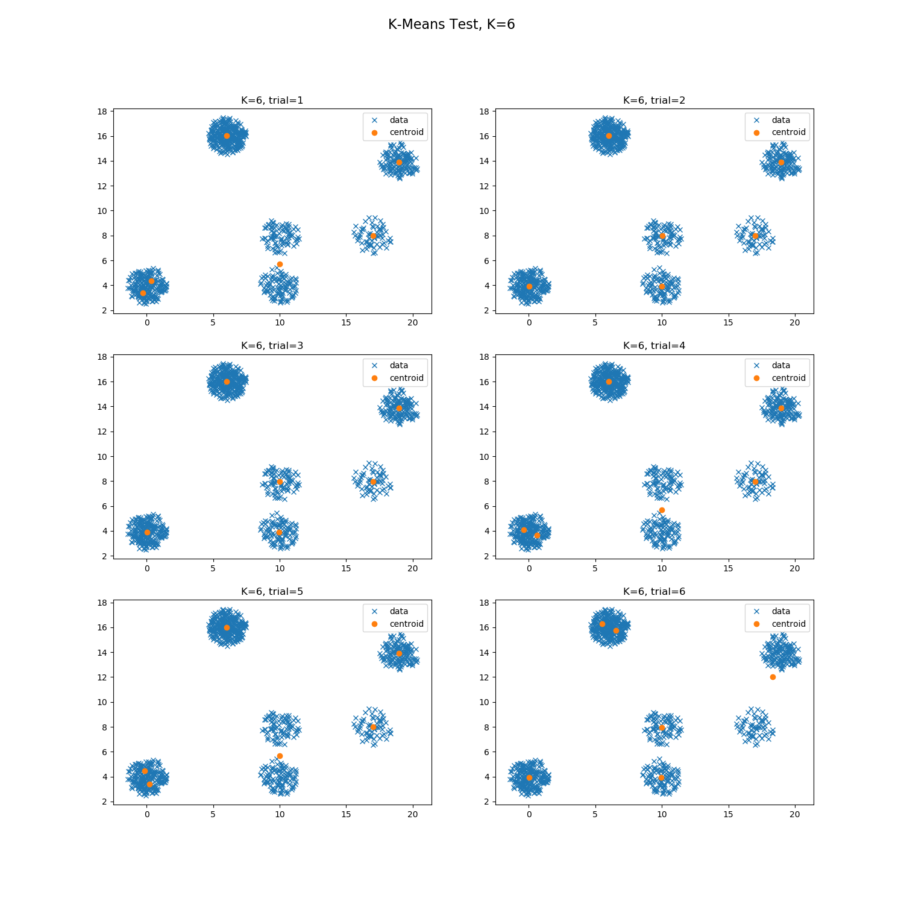

# K-Means Clustering Algorithm

The code demonstrates the usage of the K-Means clustering algorithm. We tried to replicate how the algorithm is used in industry by testing data classification with a variety of K clusters and then visually inspecting. In the image below, we test K values of 2-7.

Here we can see that K=6 Trial=5 fits the data the best.

### Input Files: 
input/points.txt (space delimited x & y float values)
### Output Files: 
output/centroids_K=X_trial=Y.txt (where X ranges from 2 to 7, and Y ranges from 0 to 5)

#### Steps to run (eclipse)
1. right click `KMeans-Cluster/src/Run.java` --> run as --> java application

**Note: upon running the code, see `visualize/README.md` for instructions on visualizing the data**

